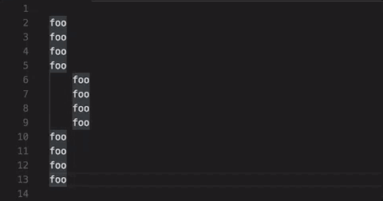

# Indentation Level Movement

Move the cursor vertically at indentation levels.

Default shortcuts are alt+up / alt+down on macOS and ctrl+up / ctrl+down on Windows and Linux.

## Release Notes

### 0.2.0

Use more precise algorithm to handle nested intentations

### 0.1.0

Initial release
